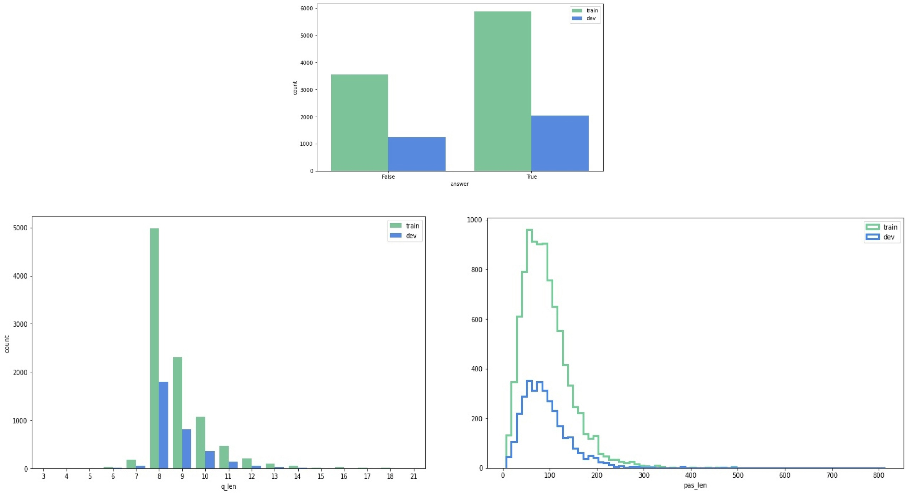
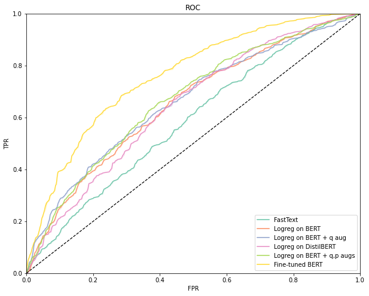
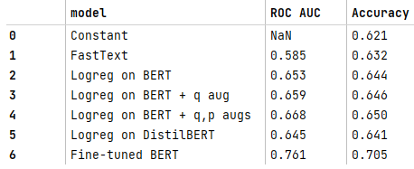

# Experiments on  "BoolQ"  dataset.
### <a href="https://github.com/d-eremeev/">Dmitry Eremeev</a>

### This repository contains code and results of several experiments on <a href="https://github.com/google-research-datasets/boolean-questions">"BoolQ"</a> dataset. It is a question answering dataset for boolean questions (Yes/No) containing  (question, passage, answer) triplets.

### The experiments are motivated by the original article: <a href="https://arxiv.org/abs/1905.10044"> BoolQ: Exploring the Surprising Difficulty of Natural Yes/No Questions
 </a>

## Details of experiments

The models could be separated into 3 groups: baselines, classifiers on top of pretrained BERT embeddings and fine-tuned BERT model for this task.

**Baselines**
- **Constant baseline**: assign majority-class to all examples.
- **FastText baseline**: train unsupervised FastText with early stopping based on Logistic Regression accuracy score.

**BERT**
- **Separated**  
  Use concatenation of pretrained BERT Embeddings for question and passage **[BERT(question), BERT(passage)]** as feature-vectors.  
  Fit Logistic Regression on top.  
  There are several sub-experiments in this approach:
  1) Pretrained <a href="https://huggingface.co/transformers/model_doc/bert.html"> BertModel</a> from 🤗 (bert-base-uncased weights).
  2) BertModel with only question *augmentations*.
  3) BertModel with both question and passage *augmentations*.
  4) Pretrained <a href="https://huggingface.co/transformers/model_doc/distilbert.html"> DistilBertModel</a> from 🤗 (distilbert-base-uncased weights).

- **Concat**  
  Fine-tuning <a href="https://huggingface.co/transformers/model_doc/bert.html#bertforsequenceclassification"> BertForSequenceClassification </a> from 🤗 on unified question / passage sequences separated by [SEP] token.

1) We randomly divide *dev.jsonl* into 2 splits of equal size for validation (*valid.csv*) and testing (*test.csv*).
2) We used <a href="https://github.com/makcedward/nlpaug">nlpaug</a> library for augmentations:
  1. **SynonymAug** for questions: substitute similar words (synonyms).
  2. **BackTranslationAug** for passages: translates text to another language and back.

## Results

## Files description
- **EDA.ipynb** - notebook with some data exploration.
- **Baselines**
  - **baselines.py** - code for running constant and FastText baselines.
- **BERT**
  - **bert_concat.py** - training loop for BertForSequenceClassification.
  - **bert_separated.py** - functions for fitting classifier on top of concatenated question/passage BERT embeddings.
  - **dataset.py** - Dataset preparation (loading, tokenization, augmentations).
  - **models.py** - wrapper for BertModel.
- **configs** - config files for the models.
- **data** - data files.
- **outputs** - logs and results of conducted experiments.
- **utils.py** - auxiliary functions.
- **run_baselines.py**, **run_bert_concat.py**, **run_bert_separated.py** - files for running pipelines.
## Training procedure
We use <a href="https://github.com/facebookresearch/hydra">Hydra</a> as config manager. Fill in the configs and run corresponding run files in the root directory.
